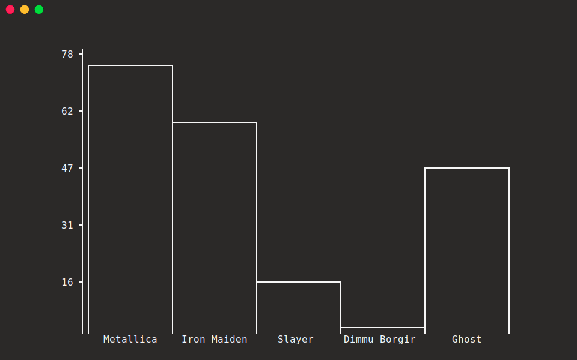

<p align="center">
  <big><strong>Machination</strong></big>
</p>

> A Haskell library for text plotting in the terminal.

<p align="center">
  <a href="https://hackage.haskell.org/package/cardano-addresses"></a>
  <a href='https://github.com/KtorZ/machination/actions?query=workflow%3A"Continuous Integration"'></a>
  <a href="https://ktorz.github.io/machination/coverage/hpc_index.html"></a>
</p>

## Overview

### Histograms

Plot [histograms](https://en.wikipedia.org/wiki/Histogram) as unicode strings in the console. For example, one could plot answers and their frequencies to the question:

_"Who's your favorite metal band?"_


```hs
import Prelude

import Plot.Text.Histogram 
    ( Histogram (..), plot )

main :: IO ()
main = putStrLn $ do
    plot $ Histogram
        { width  = 80
        , height = 24
        , bins   =
            [ ( "Metallica", 78 )
            , ( "Iron Maiden", 61 )
            , ( "Slayer", 16 )
            , ( "Dimmu Borgir", 3 )
            , ( "Ghost", 48 )
            ]
        }
```

<p align="center">
  
</p>

<hr />

<p align="center">
  <a href="https://ktorz.github.io/machination/haddock">:book: Documentation</a> 
  |
  <a href="ChangeLog.md">:floppy_disk: Changelog</a>
</p>

<p align="center">
  <a href="https://github.com/KtorZ/machination/blob/master/LICENSE"></a>
</p>
